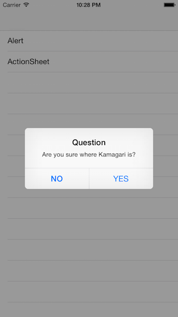
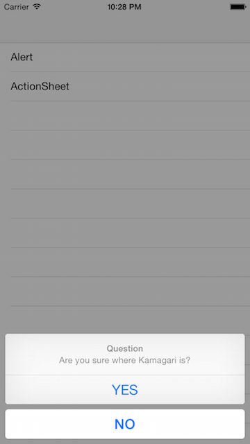

Kamagari
===
[](https://developer.apple.com/swift)
[]()
[](http://mit-license.org)
[](https://github.com/tasanobu/Kamagari/issues?state=open)

Simple UIAlertController builder class in Swift.

## Features
- AlertBuilder class to simply build UIAlertController by using method chaining
- UIAlertController extension methods to simply present UIAlertController on screen

## Usage
The following sample codes shows how to use Kamagari in order to present UIAlertController.

```
// Alert Sample
AlertBuilder(title: "Question", message: "Are you sure where Kamagari is?", preferredStyle: .Alert)
    .addAction(title: "NO", style: .Cancel) { _ in }
    .addAction(title: "YES", style: .Default) { _ in }
    .build()
    .kam_show(animated: true)

// ActionSheet Sample
if UIDevice.currentDevice().userInterfaceIdiom != .Pad {
    // Sample to show on iPad
    AlertBuilder(title: "Question", message: "Are you sure where Kamagari is?", preferredStyle: .ActionSheet)
        .addAction(title: "NO", style: .Cancel) { _ in }
        .addAction(title: "YES", style: .Default) { _ in }
        .build()
        .kam_show(animated: true)
} else {
    /*
      Sample to show on iPad
      With setPopoverPresentationProperties(), specify the properties of UIPopoverPresentationController.
    */
    AlertBuilder(title: "Question", message: "Are you sure where Kamagari is?", preferredStyle: .ActionSheet)
        .addAction(title: "YES", style: .Default) { _ in }
        .addAction(title: "Not Sure", style: .Default) { _ in }
        .setPopoverPresentationProperties(sourceView: view, sourceRect: CGRectMake(0, 0, 100, 100), barButtonItem: nil, permittedArrowDirections: .Any)
        .build()
        .kam_show(animated: true)
}
```

<table>
<td></td>
<td></td>
</table>

## Requirements
- iOS 8.0+
- Swift 3.0
- Xcode 8.0

## Installation
- Install with CocoaPods
```
pod 'Kamagari'
```
- Copy in all the files into your project
- Use git submodule

## Release Notes
See https://github.com/tasanobu/Kamagari/releases

## License
Kamagari is released under the MIT license. See LICENSE for details.
